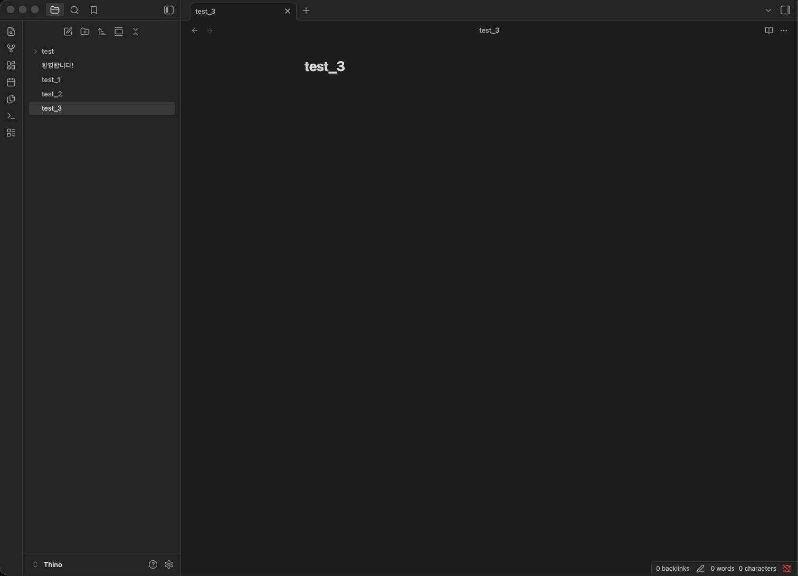
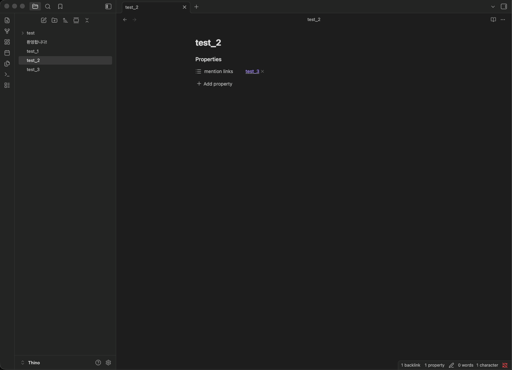

# Auto Mention

Syncs wikilinks `[[…]]` and embeds `![[…]]` in note bodies into the **target** note’s frontmatter under `mention links` (each entry points back to a mentioner). Optional reverse sync removes those body links when you delete a line from `mention links`.

## Behavior

**Forward sync**

- Body wikilinks `[[…]]` and embeds `![[…]]` update each **target** note’s mention list in frontmatter (property name is configurable in settings).
- Links with `#heading` or `^block` in the path still resolve to the correct **file**.
- If the link sits under a markdown `#` heading in the source, the line stored on the target includes that section (e.g. `[[Your note#Section]]`).

**Reverse sync**

- Optional (see settings).
- Removing a mentioner from a target’s list can strip the matching link from the source body.

**Edits & deletes**

- Saving a markdown note runs sync after the debounce delay.
- Deleting a note removes its entries from notes it used to mention.

**Privacy**

- Runs only inside your vault; no network access.

## Settings

In **Settings → Community plugins → Auto Mention** (plugin options):

**Sync**

- **Enable sync** — Turns automatic updates on or off (forward sync, and reverse when enabled).
- **Reverse sync** — Lets frontmatter edits on the target remove the body link on the mentioner.
- **Frontmatter key** — YAML property for the list (default: `mention links`).
- **Remove key when empty** — Remove the property when the list is empty, or keep `key: []`.
- **Debounce** — Delay in ms after an edit before sync runs (less churn while typing).

**Maintenance**

- **Rescan vault** — Full-vault rebuild of mention frontmatter; can touch many files.
- Requires **Enable sync** to be on.
- Also available as the palette command **Rescan vault** (same behavior).
